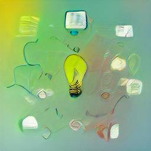

  

# أفكار
  
هنا عصف ذهني من الأفكار لبناءها كودًا برمجيًأ.
  
 
يمكنك اقتراح أفكار جديدة ومناقشتها في [تبويب المناقشات](https://github.com/Yemeni-Open-Source/ideas/discussions).

# ideas
Here is a brainstorming of ideas that we can start building as a code. 

You can suggest new ideas and discuss them in the [discuessions tab](https://github.com/Yemeni-Open-Source/ideas/discussions).
